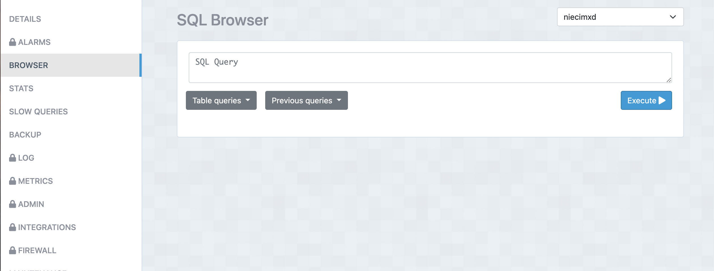

# Projet WEB

pizza-projet-web.zip qu'il faut decompresser

```
node main.js
```

se rendre sur le lien local : ``` localhost:3000 ```

### Cote Client

1. Commander en ajoutant au panier n'importe quel item (Menu,Entree, Boisson, Pizza)
2. Visualiser le panier en haut à droite
3. Confirmer La commande
4. Entrer ses informations personnelles
5. Payer : rentrer des infos factices et pour la carte ; 4242 4242 4242 4242 02/43 123
   
### Cote Livreur

1. Livrer une commande : quand un livreur livre une commande il gagne 300 points et s'il depasse un certian nombre de points il peut changer de grade (junior,veteran ...)

2. Prendre en charge une commande : une commande est soit en preparation, en route ou livrée
   
La base de données est visualisable sur elephantSQL : https://customer.elephantsql.com/instance
identifiant : ouldbelkacemnael@yahoo.fr
mot de passe : JoePizza10



Les données sont disponibles dans BROWSER sur l'onglet de gauche

Les tables disponibles sont :
    [Donnees relatives aux pages du site contenants tous nos plats]
    - Boissons
    - Entrees
    - Pizzas
    - Menus
  
    - Commandes 
    - Clients
    - Livreurs

Structure : 
[controllers] : gestion des actions sur la base de données
[db] : gestion de la base de données
[models] : gestion des tables de la base de données
[routes] : gestion des routes de notre site
[views] : gestion des pages de notre site
[views/public] : gestion du style et images de notre site
[views/partial] : gestion des blocks/layouts/modals de notre site


Partie non achevée :

- gestion des options de chaque plat

Problemes rencontrés : 

- suppression elements dans le panier
  
- sur la page delivery/livraison il est possible de prendre en charge seulement la 1ere commande :
probleme qui se situe au niveau de la page cardLivraison.ejs et modal_detailsOrder.ejs
avec une double boucle qui ne s'active pas (le deuxieme j ne veut pas demarrer ?)

- panier qui s'anime une fois sur 2 (pourtant toggle bien defini)

NB : Le fichier header.js contient le code jquery inherent au site
  